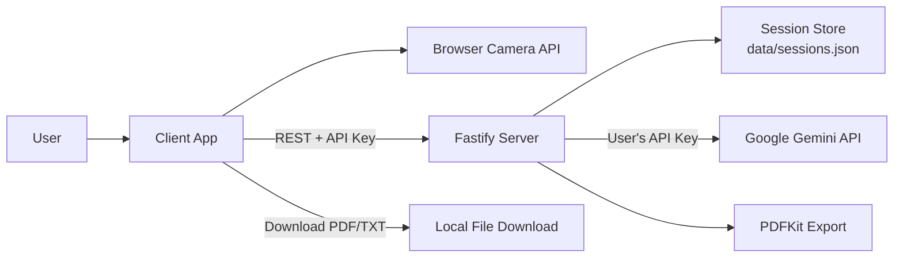
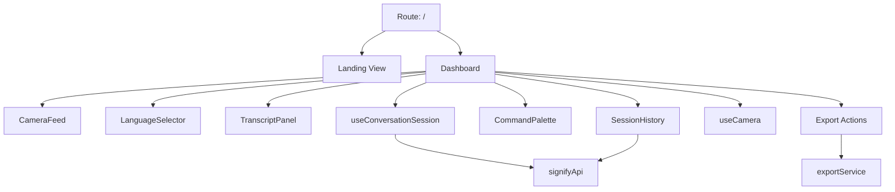
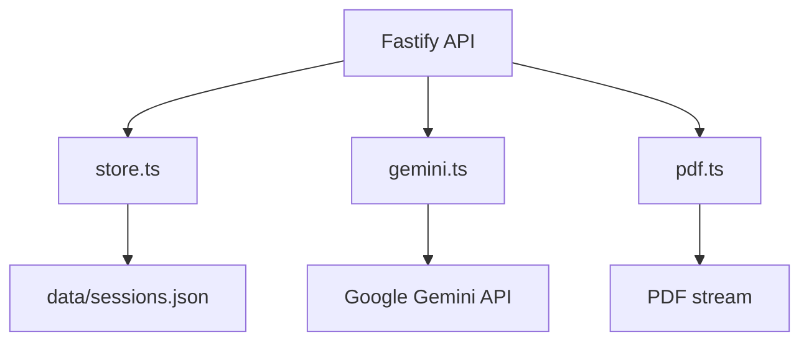
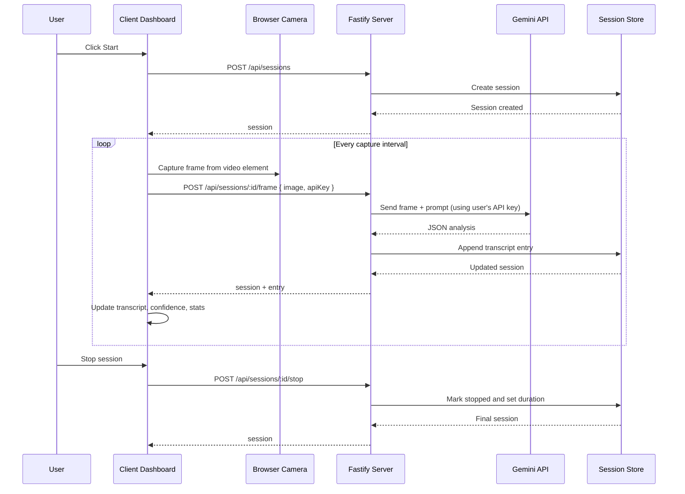

# Signify Architecture

This document describes the current project structure, the main runtime components, and the data flow between the client, backend, and Gemini API.

## High-Level Overview

Signify is a two-part application:

- A **React/TanStack Start client** for camera capture, session control, transcript viewing, and export actions.
- A **Fastify backend** that stores sessions, analyzes webcam frames with Google Gemini, and generates PDF exports.

The app is designed around a repeating capture loop:

1. The user starts a session in the browser.
2. The client captures a webcam frame every few seconds.
3. The frame is sent to the backend along with the user's Gemini API key.
4. The backend asks Gemini to interpret the sign language gesture using the user's key.
5. The translated transcript entry is appended to the session and returned to the client.
6. The UI updates in real time and can export the transcript later.

Each user provides their own Gemini API key, which is stored in the browser and sent with each request. This eliminates shared quota limits and gives users full control over their API usage.

## System Diagram

## Client Architecture

The client lives under `client/src` and is responsible for presentation, user interaction, and browser-only media access.

### Main client pieces

- `client/src/App.tsx`
  - Landing page and dashboard toggle.
  - Manages API key dialog state and renders `ApiKeyDialog`.
  - Mounts the main app shell and toast notifications.
- `client/src/components/Dashboard.tsx`
  - Central orchestration component for the live conversation experience.
  - Connects camera, session lifecycle, transcript display, export actions, and session history.
  - Shows `ApiKeyGate` when no API key is configured.
- `client/src/components/ApiKeyGate.tsx`
  - Blocks dashboard access when no API key is configured.
  - Prompts user to add their Gemini API key.
- `client/src/components/ApiKeyDialog.tsx`
  - Settings dialog for managing the user's Gemini API key.
  - Supports save, validate, show/hide, and remove operations.
- `client/src/hooks/useCamera.ts`
  - Requests webcam access through `navigator.mediaDevices`.
  - Handles device enumeration, camera enable/disable, and camera switching.
- `client/src/hooks/useApiKey.ts`
  - Manages API key state with localStorage persistence.
  - Provides save, remove, validate, and isConfigured methods.
- `client/src/hooks/useConversationSession.ts`
  - Owns the live session state machine.
  - Starts, pauses, resumes, stops, and clears a session.
  - Periodically captures frames and sends them to the backend with the user's API key.
- `client/src/services/signifyApi.ts`
  - Wraps backend REST calls.
  - Includes `validateApiKey()` for key validation.
- `client/src/services/exportService.ts`
  - Builds client-side TXT/PDF exports and clipboard output.

### Client component diagram

## Client Runtime Flow

### 1. App boot

- `client/src/server.ts` bootstraps TanStack Start on the client side.
- `client/src/router.tsx` creates the router and query client.
- `client/src/routes/__root.tsx` provides the root HTML shell, global styles, and error handling.

### 2. Landing page

- The user initially sees a landing view with a "Start Conversion" button.
- Clicking it mounts `Dashboard`.

### 3. Camera setup

- `useCamera()` requests access to the webcam.
- The camera stream is attached to the `<video>` element in `CameraFeed`.
- The user can switch devices if multiple cameras are available.

### 4. Session lifecycle

- `useConversationSession()` creates a backend session when the user starts.
- While the session is `recording`, it runs a timer loop.
- Each timer tick:
  - captures a frame from the video element,
  - sends the frame to the backend,
  - updates transcript entries and confidence from the response.

### 5. Display and export

- `TranscriptPanel` renders the translated entries.
- `SessionHistory` lists saved sessions.
- Export actions can:
  - download TXT,
  - download PDF,
  - copy transcript text to clipboard.

## Backend Architecture

The backend lives under `server/src` and is a Fastify API with file-based persistence.

### Main backend pieces

- `server/src/index.ts`
  - Fastify server entry point.
  - Registers CORS.
  - Exposes all REST endpoints.
- `server/src/store.ts`
  - In-memory session list with JSON file persistence.
- `server/src/gemini.ts`
  - Sends image frames to Gemini and parses the JSON response.
- `server/src/pdf.ts`
  - Generates a server-side PDF transcript using PDFKit.
- `server/src/types.ts`
  - Shared backend types for sessions, transcript entries, and analysis output.

### Backend component diagram

## Backend REST API

The client talks to these endpoints:

- `GET /health`
- `GET /api/languages`
- `POST /api/validate-key` — Validates a user-provided Gemini API key
- `GET /api/sessions`
- `POST /api/sessions`
- `GET /api/sessions/:id`
- `POST /api/sessions/:id/frame` — Requires `image` and `apiKey` in body
- `POST /api/sessions/:id/pause`
- `POST /api/sessions/:id/resume`
- `POST /api/sessions/:id/stop`
- `POST /api/sessions/:id/clear`
- `DELETE /api/sessions/:id`
- `GET /api/sessions/:id/pdf`

## Frame Processing Data Flow

This is the main live conversion loop.

## Session Persistence Model

Sessions are stored as JSON in `data/sessions.json` and kept in memory during process runtime.

### Session shape

- `id`
- `name`
- `language`
- `status`
- `createdAt`
- `updatedAt`
- `durationMs`
- `entries`
- `frameCount`

### Transcript entry shape

- `id`
- `timestamp`
- `text`
- `confidence`
- `sourceText` optional

## Export Paths

Signify supports two export styles:

### Client-side exports

Implemented in `client/src/services/exportService.ts`.

- TXT download from transcript entries
- PDF download from transcript entries
- Clipboard copy

### Server-side export

Implemented in `server/src/pdf.ts` and exposed through `GET /api/sessions/:id/pdf`.

- Generates a PDF from the persisted session
- Includes metadata such as session name, language, status, duration, and confidence

## Important Implementation Notes

- The backend uses a **single-process JSON store**, not a database.
- The client has **browser-only camera access**, so it must run in a browser context.
- `SessionHistory` currently mixes server sessions with a localStorage-based fallback flow.
- The backend requires a **user-provided Gemini API key** sent with each frame request. No server-side API key is used.
- API keys are stored in the browser's `localStorage` under `signify:api-key` and never persisted on the server.
- The client defaults to `http://localhost:8787` unless `VITE_API_BASE_URL` is set.

## Project Layout Summary

- `client/`
  - TanStack Start React app
  - UI, camera access, export helpers, and API client
- `server/`
  - Fastify API
  - Gemini integration
  - JSON persistence
  - PDF export
- `README.md`
  - Setup and run instructions
- `ARCHITECTURE.md`
  - This file

## Suggested Mental Model

Think of Signify as three layers:

1. **Presentation layer**: React UI in the browser.
2. **Application layer**: session logic and capture loop.
3. **Infrastructure layer**: Fastify, Gemini, file storage, and PDF generation.

That split makes the system easy to reason about:

- the UI only captures and displays state,
- the server owns truth for sessions,
- Gemini performs the interpretation step,
- export features can happen either locally or on the server.
